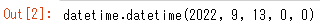
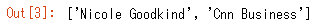
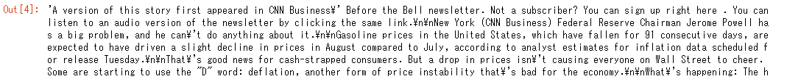
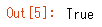
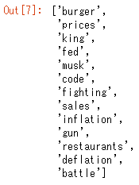
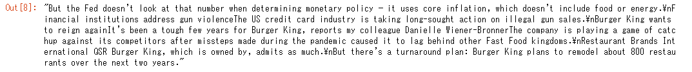

# 英語ニュースサイトから記事情報を取得
記事情報のテキスト全文やキーワードやサマリーを表示

<br>

## 対象記事


<br>

## 対象記事のURL指定
```
url = 'https://edition.cnn.com/2022/09/13/investing/premarket-stocks-trading'
article = Article(url)
```

<br>

## 対象記事のダウンロードと解析
```
article.download()
article.parse()
```

<br>

## 対象記事の発行日時
```
article.publish_date
```


<br>

## 対象記事の作成者
```
article.authors
```


<br>

## 対象記事の全文
```
article.text
```


<br>

## ライブラリのインポート
```
import nltk
nltk.download('punkt')
```


<br>

## 自然言語処理の実行
```
article.nlp()
```

<br>

## 対象記事のキーワード
```
article.keywords
```


<br>

## 対象記事のサマリー
```
article.summary
```


<br>
